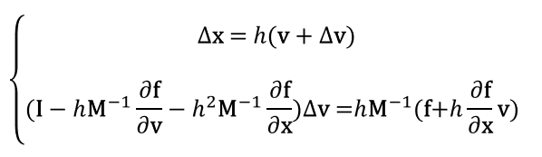
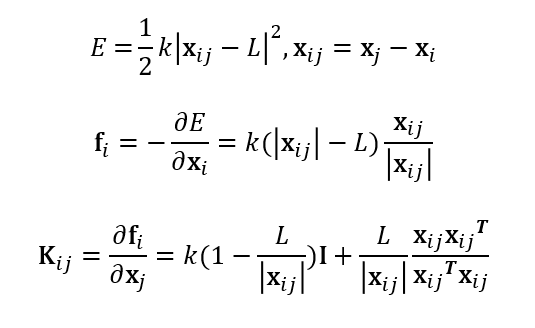
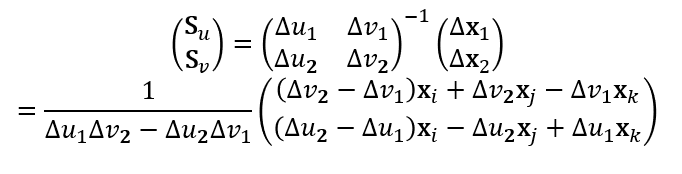
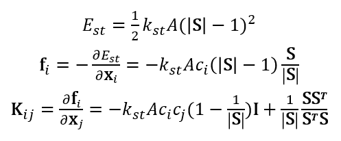
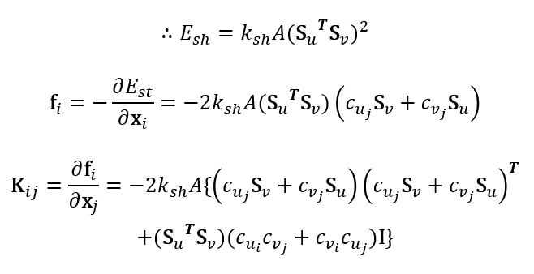
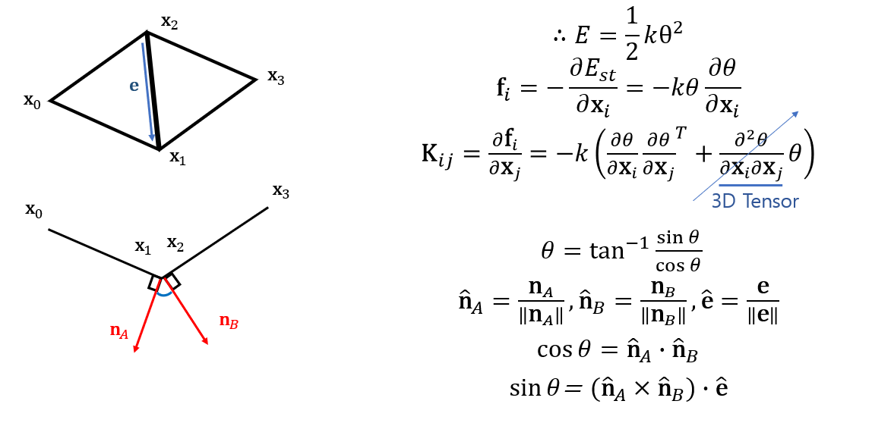
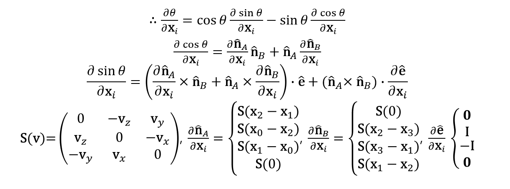
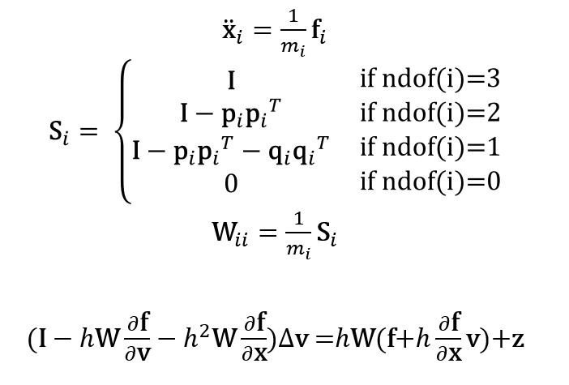
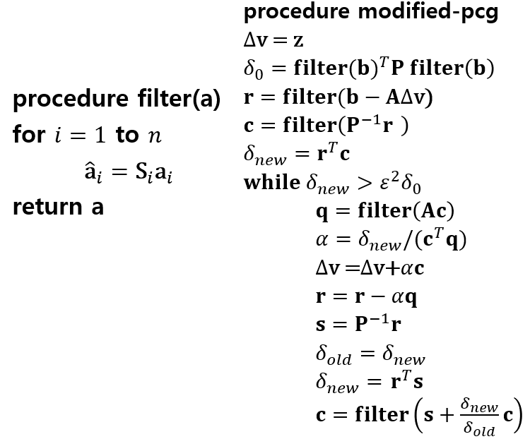

# Cloth Simulation

Cloth Simulation Visual Studio C++ Project. 

Implementation of **Baraff, D. and Witkin, Large Steps in Cloth Simulation**[[1]](#reference1) using OpenGL

## Overview

- Particle based model using triangle mesh
- In each step, calculate positions of particles 
- Implemented stretch, shear, bending force (+gravity)
- Constraints are implemented using **mass modification**
- Used **modified conjugate gradient method** to solve the system 

## Equations

### 1. Implicit Integration

    

### 2. Forces

#### 1) Basic Formula

    

#### 2) Stretch/Shear Force

    

**[Stretch]**

    

**[Shear]**

    

#### 3) Bend Force

    

    

### 3. Mass Modification

    

### 4. Modified Conjugate Gradient

**[pseudo-code]**

    

## Results

    

## Reference

<a name="reference1">[1]</a> Baraff, D. and Witkin, A. 1998. Large Steps in Cloth Simulation. In *Proceedings of SIGGRAPH 98*, Annual Conference Series, 43–54.

[2] Prichard, D. 2003. Implementing Baraff & Witkin's Cloth Simulation

[3] Shewchuk, J. 1994. An introduction to the conjugate gradient method without the agonizing pain. Technical Report CMUCS-TR-94-125, Carnegie Mellon University.

